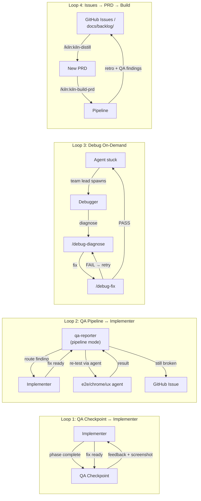
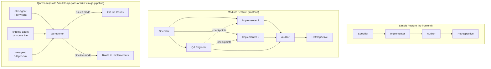
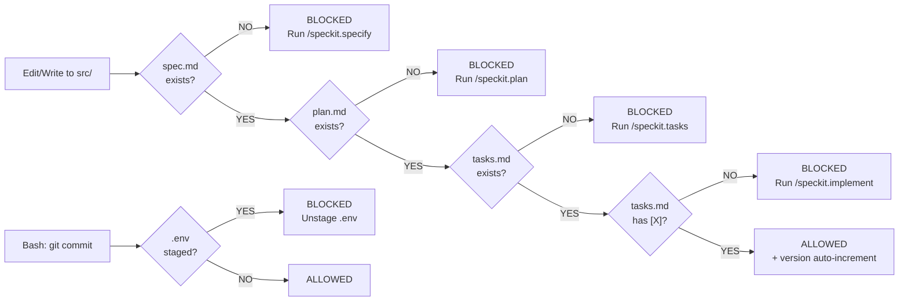

# System Architecture

## Complete System Diagram

```mermaid
flowchart TB
    %% ============================================
    %% ENTRY POINTS
    %% ============================================
    subgraph Entry["Entry Points"]
        init["/kiln:kiln-init<br/>Add speckit to existing repo"]
        createRepo["/clay:clay-create-repo<br/>New GitHub repo + scaffold"]
        resume["/kiln:kiln-resume<br/>Auto-detect state, next steps"]
    end

    %% ============================================
    %% PROJECT FOUNDATION
    %% ============================================
    subgraph Foundation["Project Foundation"]
        scaffold["init.mjs scaffold"]
        claudeMd["CLAUDE.md"]
        constitution[".specify/memory/constitution.md"]
        prdTemplate["docs/PRD.md"]
        versionFile["VERSION<br/>000.000.000.000"]
        hooks["Hooks<br/>require-spec · version-increment · block-env"]
    end

    init --> scaffold
    createRepo --> scaffold
    scaffold --> claudeMd & constitution & prdTemplate & versionFile & hooks

    %% ============================================
    %% PRD CREATION
    %% ============================================
    subgraph PRD["PRD Creation"]
        createPrd["/kiln:kiln-create-prd"]
        issueToPrd["/kiln:kiln-distill<br/>Bundle backlog + feedback → PRD"]
        prdDoc["docs/PRD.md or<br/>docs/features/*/PRD.md"]
    end

    createPrd --> prdDoc
    issueToPrd --> prdDoc

    %% ============================================
    %% BUILD-PRD PIPELINE
    %% ============================================
    subgraph Pipeline["Build-PRD Pipeline (/kiln:kiln-build-prd)"]
        direction TB

        subgraph Preflight["Pre-Flight"]
            readPrd["Read PRD + Constitution"]
            commitChanges["Commit uncommitted changes"]
            createBranch["Create branch from HEAD"]
            designTeam["Design agent team"]
        end

        subgraph SpecPhase["Phase 1: Specification"]
            specifier["Specifier Agent"]
            specify["/speckit.specify<br/>→ spec.md"]
            plan["/speckit.plan<br/>→ plan.md + contracts/"]
            tasks["/speckit.tasks<br/>→ tasks.md"]
        end

        subgraph ResearchPhase["Phase 2: Research (optional)"]
            researcher["Researcher Agent"]
            researchMd["research.md + vendor/"]
        end

        subgraph ImplPhase["Phase 3: Implementation (parallel)"]
            impl1["Implementer 1<br/>/speckit.implement"]
            impl2["Implementer 2<br/>/speckit.implement"]
            implN["Implementer N..."]
        end

        subgraph QAPhase["Phase 4: QA"]
            qaEngineer["QA Engineer Agent<br/>(long-lived)"]

            subgraph Checkpoint["Checkpoint Mode<br/>(during implementation)"]
                qaCheckpoint["/kiln:kiln-qa-checkpoint"]
                checkpointFeedback["SendMessage → Implementer<br/>actionable feedback"]
            end

            subgraph QAPipelineTeam["Final Mode: /kiln:kiln-qa-pipeline<br/>(4-agent team)"]
                e2eAgent["e2e-agent<br/>Playwright E2E suite"]
                chromeAgent["chrome-agent<br/>/chrome live data"]
                uxAgent["ux-agent<br/>3-layer evaluation"]
                qaReporterPipeline["qa-reporter<br/>MODE: pipeline"]
            end

            qaFinalGate["/kiln:kiln-qa-final<br/>Quick green/red gate"]
        end

        subgraph AuditPhase["Phase 5: Audit (parallel)"]
            auditCompliance["audit-compliance<br/>/speckit.audit"]
            auditTests["audit-tests<br/>Coverage gate"]
            auditSmoke["audit-smoke<br/>smoke-tester agent"]
            auditPr["audit-pr<br/>Create PR"]
        end

        subgraph RetroPhase["Phase 6: Retrospective"]
            retro["Retrospective Agent"]
            retroIssue["GitHub Issue<br/>label: build-prd"]
        end
    end

    %% Pipeline flow
    prdDoc --> readPrd
    readPrd --> commitChanges --> createBranch --> designTeam
    designTeam --> specifier
    specifier --> specify --> plan --> tasks

    tasks --> researcher
    tasks --> impl1 & impl2 & implN
    researcher --> researchMd --> impl1

    %% QA checkpoint loop
    impl1 & impl2 --> qaEngineer
    qaEngineer --> qaCheckpoint
    qaCheckpoint --> checkpointFeedback
    checkpointFeedback -.->|"fix ready"| qaCheckpoint

    %% QA final
    impl1 & impl2 & implN -->|"all complete"| e2eAgent & chromeAgent & uxAgent
    e2eAgent & chromeAgent & uxAgent --> qaReporterPipeline
    qaReporterPipeline -->|"route findings"| impl1 & impl2
    qaReporterPipeline -->|"file unfixed"| ghIssuesQA["GitHub Issues<br/>labels: qa-pass + build-prd"]
    qaReporterPipeline --> qaFinalGate

    %% Audit
    qaFinalGate -->|"green"| auditCompliance & auditTests & auditSmoke
    auditCompliance & auditTests & auditSmoke --> auditPr
    auditPr --> prCreated["PR Created<br/>label: build-prd"]

    %% Retrospective
    prCreated --> retro
    retro --> retroIssue

    %% ============================================
    %% UX EVALUATION (3-LAYER)
    %% ============================================
    subgraph UXLayers["UX Agent: 3-Layer Evaluation"]
        layer1["Layer 1: Programmatic<br/>axe-core · contrast-check.js · layout-check.js<br/>via evaluate_script"]
        layer2["Layer 2: Semantic<br/>take_snapshot → accessibility tree<br/>Nielsen's 10 heuristics"]
        layer3["Layer 3: Visual<br/>take_screenshot → Claude vision<br/>Spacing · typography · alignment · hierarchy"]
    end

    uxAgent --> layer1 & layer2 & layer3

    %% ============================================
    %% STANDALONE QA (outside pipeline)
    %% ============================================
    subgraph StandaloneQA["/kiln:kiln-qa-pass (Standalone)"]
        e2eStandalone["e2e-agent"]
        chromeStandalone["chrome-agent"]
        uxStandalone["ux-agent"]
        reporterStandalone["qa-reporter<br/>MODE: issues"]
        ghIssuesStandalone["GitHub Issues<br/>label: qa-pass"]
    end

    e2eStandalone & chromeStandalone & uxStandalone --> reporterStandalone
    reporterStandalone -->|"file immediately"| ghIssuesStandalone

    %% ============================================
    %% BUG FIX WORKFLOW
    %% ============================================
    subgraph FixFlow["/kiln:kiln-fix (Bug Fix — No Spec Required)"]
        fixEntry["/kiln:kiln-fix [issue] or /kiln:kiln-fix #42"]
        debugger["Debugger Agent"]
        diagnose["/debug-diagnose<br/>Classify · select technique · collect evidence"]
        fixApply["/debug-fix<br/>Apply fix · verify · revert on fail"]
        debugLog["debug-log.md<br/>Track attempts, avoid repeats"]
    end

    fixEntry --> debugger
    debugger --> diagnose --> fixApply
    fixApply -->|"FAIL"| diagnose
    fixApply -->|"PASS"| debugLog
    diagnose --> debugLog
    fixApply -->|"UI fix"| e2eStandalone & chromeStandalone & uxStandalone

    %% ============================================
    %% ISSUE LIFECYCLE
    %% ============================================
    subgraph IssueCycle["Issue Lifecycle"]
        reportIssue["/kiln:kiln-report-issue"]
        backlog["docs/backlog/<br/>timestamped entries"]
        issueToPrdCycle["/kiln:kiln-distill<br/>Bundle → PRD"]
    end

    ghIssuesQA --> reportIssue
    ghIssuesStandalone --> reportIssue
    retroIssue --> reportIssue
    reportIssue --> backlog
    backlog --> issueToPrdCycle
    issueToPrdCycle --> prdDoc

    %% ============================================
    %% HOOKS (always active)
    %% ============================================
    subgraph HookEnforcement["Hook Enforcement (PreToolUse)"]
        gate1["Gate 1: spec.md exists?"]
        gate2["Gate 2: plan.md exists?"]
        gate3["Gate 3: tasks.md exists?"]
        gate4["Gate 4: tasks.md has [X]?"]
        versionHook["version-increment.sh<br/>Auto-increment edit segment"]
        envHook["block-env-commit.sh<br/>Block .env in commits"]
    end

    gate1 --> gate2 --> gate3 --> gate4
    gate4 -->|"all pass"| versionHook

    %% ============================================
    %% VERSIONING
    %% ============================================
    subgraph Versioning["Versioning (release.feature.pr.edit)"]
        versionCmd["/kiln:kiln-version<br/>Show current"]
        versionBump["scripts/version-bump.sh"]
        versionSync["Syncs to:<br/>VERSION · package.json · plugin.json"]
    end

    versionHook --> versionSync
    versionBump --> versionSync

    %% ============================================
    %% STYLING
    %% ============================================
    classDef entry fill:#4CAF50,color:#fff,stroke:#333
    classDef skill fill:#2196F3,color:#fff,stroke:#333
    classDef agent fill:#FF9800,color:#fff,stroke:#333
    classDef artifact fill:#9C27B0,color:#fff,stroke:#333
    classDef hook fill:#F44336,color:#fff,stroke:#333
    classDef qa fill:#00BCD4,color:#fff,stroke:#333

    class init,createRepo,resume entry
    class specify,plan,tasks,qaCheckpoint,qaFinalGate,fixEntry,reportIssue,issueToPrdCycle,createPrd,versionCmd skill
    class specifier,researcher,impl1,impl2,implN,qaEngineer,e2eAgent,chromeAgent,uxAgent,qaReporterPipeline,auditCompliance,auditTests,auditSmoke,auditPr,retro,debugger,e2eStandalone,chromeStandalone,uxStandalone,reporterStandalone agent
    class prdDoc,claudeMd,constitution,versionFile,debugLog,backlog,prCreated,retroIssue,ghIssuesQA,ghIssuesStandalone,researchMd artifact
    class gate1,gate2,gate3,gate4,versionHook,envHook,hooks hook
    class layer1,layer2,layer3 qa
```

## Feedback Loops

```mermaid
flowchart LR
    subgraph Loop1["Loop 1: QA Checkpoint ↔ Implementer"]
        implA["Implementer"] -->|"phase complete"| qaC["QA Checkpoint"]
        qaC -->|"feedback + screenshot"| implA
        implA -->|"fix ready"| qaC
    end

    subgraph Loop2["Loop 2: QA Pipeline ↔ Implementer"]
        qaR["qa-reporter<br/>(pipeline mode)"] -->|"route finding"| implB["Implementer"]
        implB -->|"fix ready"| qaR
        qaR -->|"re-test via agent"| retest["e2e/chrome/ux agent"]
        retest -->|"result"| qaR
        qaR -->|"still broken"| ghIssue["GitHub Issue"]
    end

    subgraph Loop3["Loop 3: Debug On-Demand"]
        stuck["Agent stuck"] -->|"team lead spawns"| dbg["Debugger"]
        dbg -->|"diagnose"| diag["/debug-diagnose"]
        diag -->|"fix"| fix["/debug-fix"]
        fix -->|"FAIL → retry"| diag
        fix -->|"PASS"| stuck
    end

    subgraph Loop4["Loop 4: Issues → PRD → Build"]
        issues["GitHub Issues /<br/>docs/backlog/"] -->|"/kiln:kiln-distill"| newPrd["New PRD"]
        newPrd -->|"/kiln:kiln-build-prd"| pipeline["Pipeline"]
        pipeline -->|"retro + QA findings"| issues
    end
```

## Agent Team Structures

```mermaid
flowchart TB
    subgraph Simple["Simple Feature (no frontend)"]
        s1["Specifier"] --> s2["Implementer"] --> s3["Auditor"] --> s4["Retrospective"]
    end

    subgraph Medium["Medium Feature (frontend)"]
        m1["Specifier"] --> m2["Implementer 1"]
        m1 --> m3["Implementer 2"]
        m1 --> m4["QA Engineer"]
        m4 -.->|"checkpoints"| m2 & m3
        m2 & m3 & m4 --> m5["Auditor"] --> m6["Retrospective"]
    end

    subgraph QATeam["QA Team (inside /kiln:kiln-qa-pass or /kiln:kiln-qa-pipeline)"]
        q1["e2e-agent<br/>Playwright"] --> q4["qa-reporter"]
        q2["chrome-agent<br/>/chrome live"] --> q4
        q3["ux-agent<br/>3-layer eval"] --> q4
        q4 -->|"issues mode"| q5["GitHub Issues"]
        q4 -->|"pipeline mode"| q6["Route to Implementers"]
    end
```

## Hook Gate Sequence

```mermaid
flowchart LR
    edit["Edit/Write to src/"] --> g1{"spec.md<br/>exists?"}
    g1 -->|"NO"| block1["BLOCKED<br/>Run /speckit.specify"]
    g1 -->|"YES"| g2{"plan.md<br/>exists?"}
    g2 -->|"NO"| block2["BLOCKED<br/>Run /speckit.plan"]
    g2 -->|"YES"| g3{"tasks.md<br/>exists?"}
    g3 -->|"NO"| block3["BLOCKED<br/>Run /speckit.tasks"]
    g3 -->|"YES"| g4{"tasks.md<br/>has [X]?"}
    g4 -->|"NO"| block4["BLOCKED<br/>Run /speckit.implement"]
    g4 -->|"YES"| allow["ALLOWED<br/>+ version auto-increment"]

    commit["Bash: git commit"] --> envCheck{".env<br/>staged?"}
    envCheck -->|"YES"| blockEnv["BLOCKED<br/>Unstage .env"]
    envCheck -->|"NO"| allowCommit["ALLOWED"]
```
