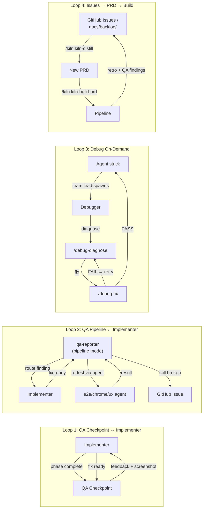
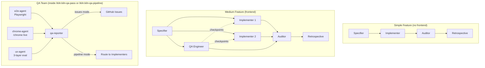
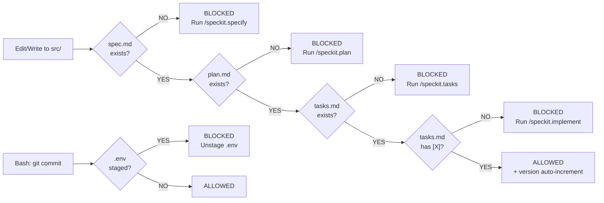

# System Architecture

> **Autonomous rearchitecture in progress.** The diagrams below describe the established
> system. The target autonomous build loop is specified in
> `docs/features/2026-06-22-kiln-autonomous-rearchitecture/MASTER_PLAN.md` and sequenced in
> that folder's `IMPLEMENTATION_PLAN.md`. The build-status section tracks what has landed.

## Autonomous Rearchitecture — Build Status

Staged build of the autonomous loop. Each stage is implemented, dogfooded live (fresh
isolated subprocess) where the harness allows, reviewed by agents, and pushed before the
next begins.

**Status: all 6 phases (0–5) landed and pushed.** A final completeness-audit sub-agent
confirmed every phase's deliverable exists, matches this doc + the MASTER_PLAN, passes the
structural gate, and respects all invariants (propose-don't-apply, hooks fail-open, no
`model_tier`/`on_failure`/`on:always`, portability, `path:ledger/` consistency) — no
blocking issues.

**Live E2E verification (campaign run — `tests/dogfood/run-workflow-e2e.sh`, recipe in
`tests/dogfood/E2E-RECIPE.md`):**

| Workflow | Result |
|---|---|
| kiln-distill | ✅ E2E `history/success/` 7/7 — produced a real senior-quality PRD from seeded captures |
| kiln-mistake-record | ✅ E2E `history/success/` 3/3 — wrote `.kiln/mistakes` + `.kiln/ledger` (correct id) |
| kiln-self-improve | ✅ substantive 5/6 — **propose-don't-apply held** (L1 applied 0 at threshold=none; config→low/hook→high); only optional Obsidian sync pending at turn-end |
| kiln-fix | ✅ substantive 5/7 — **diagnosed + FIXED the bug** (`return a-b`→`a+b`) + verified; ledger/summary pending at turn-end |
| Phase-4 hooks | ✅ verified by direct invocation (block / allow / fail-open across all scenarios) |
| kiln-build-prd (linear steps) | ✅ config→prd→standards→manifest→precedent drive E2E |
| kiln-build-prd (team steps) | ⚠️ dispatch proven (Stop hook emits the exact `TeamCreate(...)` call) but **team EXECUTION can't run under `claude --print`** — `TeamCreate`/`Agent` are interactive-session-only (not exposed headless). Covered by wheel's own CI team fixtures + structural equivalence. |

**Auto mode (the checkpoint/autonomy model) — tested both ways.** A checkpoint-smoke fixture
proved the branch+approval mechanism: in **autonomous** config (`review_checkpoints: []`) the
checkpoint **skips** and the workflow self-drives to completion; in **supervised** config
(checkpoint name present) it **pauses** at the approval step (`approve-test:working`,
`done-step:skipped`) awaiting human approval. Team execution is proven via interactive tmux
(`run-team-e2e.sh`).

**Real bugs E2E found and fixed** (all silently broke build-prd; structural/contract review
couldn't catch them — they're wheel runtime-semantics): (1) nested `type:workflow` steps stall
the headless loop → build-prd's `query-precedent` inlined; (2) `branch` steps use a **`condition`**
field (not `command`), run via `eval` so it must be **quote-free** → 4 checkpoints rewritten;
(3) command steps don't auto-write their `output` file (wheel stores stdout in state) → 8
command steps across build-prd/kiln-fix given explicit `tee`/redirect.

Two platform limits of headless `--print` testing: (1) longer agent-heavy workflows truncate at
`--print`'s turn limit (finish via state-cursor resume); (2) team tools are interactive-only, so
team execution uses the tmux path.

### Phase 0 — Config Foundation ✅ (landed)

Every project declares its coding standards and review preferences; `kiln-init` scaffolds
them; `kiln-doctor`/`kiln-next` read them.

- **`.kiln/config.json`** (scaffolded from `plugin-kiln/scaffold/config-template.json`) —
  `config_version`, `review_mode` + `review_checkpoints`, `auto_build/auto_pr/auto_merge`,
  `issue_batch_threshold`, `distill_threshold`, `branching{style,integration_branch,per_feature}`,
  per-tier `models{}`, `notifications{}`.
- **`.kiln/standards.md`** — coding standards, injected into `plan`/`implement` agent prompts
  via `compose-context.sh --standards`, enforced at audit.
- **`.kiln/test-strategy.json`** — `coverage_gate`, `test`, `smoke{}`, `design_verify`.
- **`scaffold/doctor-manifest.json`** — version-keyed health checks read from the plugin
  install path (not copied to consumers); run by `kiln-doctor` step 3i via
  `scripts/doctor/config-check.sh`.
- **`kiln-init`** wizard: prefers bundled `bin/init.mjs`; steps 3b (vision), 5b (design_first),
  5c (branching).
- **`kiln-next`**: reads config; authoritative 8-level priority stack (pending-review →
  interrupted-run → failing-tests → issues large/small → captures-to-distill → PRD-ready →
  all-clear) with the two-track model (issues=fix, feedback/roadmap=distill).
- **Capture hardening**: collision-safe issue filenames (`scripts/issues/alloc-issue-filename.sh`,
  atomic O_EXCL); the shared shelf full-sync counter now ticks on all four capture surfaces
  (`scripts/capture/counter-tick.sh` wired into report-issue/feedback/roadmap/mistake).
- **Dogfood harness**: `plugin-kiln/tests/dogfood/run-scenario.sh` — drives skills live in an
  isolated fresh `claude` subprocess loading local plugin source via `--plugin-dir`, records cost.

### Phase 1 — Ledger + Precedent System ✅ (landed)

Past mistakes from all projects become queryable before any new build.

- **`workflows/kiln-precedent.json`** — extracts PRD topic/stack tags, queries the vault
  (`search_vault`, `path:ledger/`) for relevant past mistakes, emits a `## Precedent` block
  for injection into specify/plan/implement prompts. Degrades to an empty block when
  `search_vault` (net-new MCP tool, built separately) is unavailable.
- **`workflows/kiln-mistake-record.json`** — from `{summary,assumption,correction,source}`,
  writes `.kiln/mistakes/<id>.md` + `.kiln/ledger/<id>.json` (id = `<YYYY-MM-DD>-<slug>`),
  mirrors to the vault `ledger/` path, self-skips on absent input.
- **`agents/precedent-reader.md`** (haiku), **`agents/risk-classifier.md`** (sonnet).
- **`skills/kiln-ledger`** — read-only ledger history (`--kind/--tag/--last`).
- **`.kiln/ledger/`** + `.kiln/ledger/proposals/` scaffolded by init; schemas in
  `scaffold/ledger-schema.md`.
- **Integration**: `kiln-report-issue` judges AI-class → writes `mistake-data.json` → the
  background sub-agent records it via `kiln-mistake-record` (off the critical path);
  `shelf-sync` gains a `ledger-mirror` step that backfills the full ledger to the vault.
- All vault read/write paths standardized on `ledger/` so precedent finds mirrored entries.

> **Verification note.** Phase 1's *contract* is dogfood-verified (id format, all 8 ledger
> schema fields, three-axis tags, `blast_radius`, graceful Obsidian degradation, and the
> `kiln-ledger` table all correct). The skill-dogfood harness (`--plugin-dir` + `claude
> --print`) exercises **skills** well but does **not** reliably run **wheel workflows** via
> `/wheel:wheel-run` in a subprocess — live wheel-workflow execution uses wheel's
> `activate.sh` isolated recipe or `wheel-test-runner` fixtures instead. Establishing that
> path is the first task of Phase 2 (which converts `kiln-build-prd` into a wheel workflow).

### Phase 2 — Build Pipeline as Wheel Workflow ✅ (landed)

`kiln-build-prd` is now a resumable 38-step wheel workflow that launches **real parallel
teams** via wheel's native primitives (`team-create` → `teammate` → `team-wait` →
`team-delete`).

- **`workflows/kiln-build-prd.json`** (38 steps): read-config/prd/standards → init-manifest →
  `query-precedent` (native sub-workflow) → specify → **checkpoint** → plan → tasks → gate →
  **implement team** → test → smoke → **checkpoint** → **audit panel team** → synthesize →
  fix-blocking → **checkpoint** → create-pr → **checkpoint** → retro → classify → summary.
- **Teams:** implement = `kiln-implement-worker` teammate (bounded static slot; expandable);
  audit = a 3-member parallel panel (`prd-auditor` + `spec-enforcer` + `quality-judge`, one
  `kiln-audit-worker` slot per role via `assign.role`) → `team-wait` → synthesize. Each role's
  knowledge lives in its sub-workflow's agent-step instruction (wheel teammates run as
  general-purpose).
- **Checkpoints** are `branch` + `approval` pairs gated on `review_checkpoints[]` / upstream
  blocking severity / `auto_*` (a command can't pause; `approval` can).
- **`workflows/kiln-distill.json`** (7 steps) and **`workflows/kiln-fix.json`** (7 steps).
- **Skills** `kiln-build-prd` / `kiln-fix` / `kiln-distill` / `kiln-resume` are now thin
  wrappers (build-prd: 99 lines, was 1430) that write `.wheel/inputs/*` and call `wheel-run`.
- **`agents/build-summary.md`** (haiku, terminal) renders the canonical 5-table summary.

Encoded to the **real** wheel runtime: concrete models (no `model_tier`), defensive exit-0
(no `on_failure`), `branch` routing, native `workflow`/`team-*` steps. Two review passes fixed
the team collect-path contract, the resume semantics (state-file cursor, not output-file
existence), and JSON hygiene.

> **Verification.** Structural gate (`tests/dogfood/validate-workflow-structure.sh`) passes on
> all five workflows; wheel's own team fixtures prove live team launch; a full live
> `kiln-build-prd` fixture (wheel-test-runner) is a follow-up. **Residual wheel gaps** (would
> need a wheel change → approval): dynamic per-story implementer fan-out, per-teammate worktree
> isolation + auto-merge. v1 uses a bounded static team with a single implementer slot.

### Phase 3 — Self-Improvement Loop ✅ (landed)

- **`workflows/kiln-self-improve.json`** (6 steps): collect-friction → classify-risk →
  apply-l1-patches → surface-l2-chips → write-summary → sync-to-obsidian. L1 = config-file
  patches only; L2 (SKILL/hook/workflow) surfaced as text (chip API deferred, G4).
- **`skills/kiln-pi-apply`** → thin redirect; **`skills/kiln-improve`** → preferred-name alias.
- **Propose-don't-apply preserved:** L1 auto-apply gates on `pi_apply_threshold` and applies
  nothing by default — the human opts in.

### Phase 4 — Hooks + Gates ✅ (landed)

Three enforcement hooks (`hooks/{coverage-gate,untraced-test-gate,merge-bar}.sh`) registered
alongside the original four. Coverage gate (post-test), test-traceability gate (test-file
writes need an FR/AC ref), and merge bar (`gh pr create` needs ≥80% compliance, all tasks
`[X]`, no blocking blockers). All **fail open** on their own errors and use narrow matchers.

### Phase 5 — Observability + Vision ✅ (kiln-side landed)

- **vision-filter** (kiln-distill) declines off-vision captures · **vision-verify** (build-prd
  smoke-review `design_verify` path) scores design fidelity · **vision-drift-check** (audit
  panel) flags `kind:drift` when code contradicts `vision.md`/`docs/architecture.md`.
- **wheel-view live-journal streaming** (stream `.kiln/runs/<id>/journal` during active runs)
  touches the **wheel submodule** — deferred as **G2** (needs explicit approval + thorough
  testing per the wheel-change policy); not implemented here.

## Residual decisions for the human

- **G2** — wheel changes that would complete the design: (a) wheel-view live-journal streaming,
  (b) dynamic per-story implementer fan-out, (c) per-teammate worktree isolation + auto-merge.
  Each needs explicit approval + thorough testing.
- **G3** — the Obsidian MCP `search_vault` tool (precedent read path) is built separately; the
  kiln side degrades gracefully until it ships.
- **G4** — the L2 improvement-chip UI; surfaced as text until the task-chip API is available.

## Complete System Diagram

```mermaid
flowchart TB
    %% ============================================
    %% ENTRY POINTS
    %% ============================================
    subgraph Entry["Entry Points"]
        init["/kiln:kiln-init<br/>Add speckit to existing repo"]
        createRepo["/clay:clay-create-repo<br/>New GitHub repo + scaffold"]
        resume["/kiln:kiln-resume<br/>Auto-detect state, next steps"]
    end

    %% ============================================
    %% PROJECT FOUNDATION
    %% ============================================
    subgraph Foundation["Project Foundation"]
        scaffold["init.mjs scaffold"]
        claudeMd["CLAUDE.md"]
        constitution[".specify/memory/constitution.md"]
        prdTemplate["docs/PRD.md"]
        versionFile["VERSION<br/>000.000.000.000"]
        hooks["Hooks<br/>require-spec · version-increment · block-env"]
    end

    init --> scaffold
    createRepo --> scaffold
    scaffold --> claudeMd & constitution & prdTemplate & versionFile & hooks

    %% ============================================
    %% PRD CREATION
    %% ============================================
    subgraph PRD["PRD Creation"]
        createPrd["/kiln:kiln-create-prd"]
        issueToPrd["/kiln:kiln-distill<br/>Bundle backlog + feedback → PRD"]
        prdDoc["docs/PRD.md or<br/>docs/features/*/PRD.md"]
    end

    createPrd --> prdDoc
    issueToPrd --> prdDoc

    %% ============================================
    %% BUILD-PRD PIPELINE
    %% ============================================
    subgraph Pipeline["Build-PRD Pipeline (/kiln:kiln-build-prd)"]
        direction TB

        subgraph Preflight["Pre-Flight"]
            readPrd["Read PRD + Constitution"]
            commitChanges["Commit uncommitted changes"]
            createBranch["Create branch from HEAD"]
            designTeam["Design agent team"]
        end

        subgraph SpecPhase["Phase 1: Specification"]
            specifier["Specifier Agent"]
            specify["/speckit.specify<br/>→ spec.md"]
            plan["/speckit.plan<br/>→ plan.md + contracts/"]
            tasks["/speckit.tasks<br/>→ tasks.md"]
        end

        subgraph ResearchPhase["Phase 2: Research (optional)"]
            researcher["Researcher Agent"]
            researchMd["research.md + vendor/"]
        end

        subgraph ImplPhase["Phase 3: Implementation (parallel)"]
            impl1["Implementer 1<br/>/speckit.implement"]
            impl2["Implementer 2<br/>/speckit.implement"]
            implN["Implementer N..."]
        end

        subgraph QAPhase["Phase 4: QA"]
            qaEngineer["QA Engineer Agent<br/>(long-lived)"]

            subgraph Checkpoint["Checkpoint Mode<br/>(during implementation)"]
                qaCheckpoint["/kiln:kiln-qa-checkpoint"]
                checkpointFeedback["SendMessage → Implementer<br/>actionable feedback"]
            end

            subgraph QAPipelineTeam["Final Mode: /kiln:kiln-qa-pipeline<br/>(4-agent team)"]
                e2eAgent["e2e-agent<br/>Playwright E2E suite"]
                chromeAgent["chrome-agent<br/>/chrome live data"]
                uxAgent["ux-agent<br/>3-layer evaluation"]
                qaReporterPipeline["qa-reporter<br/>MODE: pipeline"]
            end

            qaFinalGate["/kiln:kiln-qa-final<br/>Quick green/red gate"]
        end

        subgraph AuditPhase["Phase 5: Audit (parallel)"]
            auditCompliance["audit-compliance<br/>/speckit.audit"]
            auditTests["audit-tests<br/>Coverage gate"]
            auditSmoke["audit-smoke<br/>smoke-tester agent"]
            auditPr["audit-pr<br/>Create PR"]
        end

        subgraph RetroPhase["Phase 6: Retrospective"]
            retro["Retrospective Agent"]
            retroIssue["GitHub Issue<br/>label: build-prd"]
        end
    end

    %% Pipeline flow
    prdDoc --> readPrd
    readPrd --> commitChanges --> createBranch --> designTeam
    designTeam --> specifier
    specifier --> specify --> plan --> tasks

    tasks --> researcher
    tasks --> impl1 & impl2 & implN
    researcher --> researchMd --> impl1

    %% QA checkpoint loop
    impl1 & impl2 --> qaEngineer
    qaEngineer --> qaCheckpoint
    qaCheckpoint --> checkpointFeedback
    checkpointFeedback -.->|"fix ready"| qaCheckpoint

    %% QA final
    impl1 & impl2 & implN -->|"all complete"| e2eAgent & chromeAgent & uxAgent
    e2eAgent & chromeAgent & uxAgent --> qaReporterPipeline
    qaReporterPipeline -->|"route findings"| impl1 & impl2
    qaReporterPipeline -->|"file unfixed"| ghIssuesQA["GitHub Issues<br/>labels: qa-pass + build-prd"]
    qaReporterPipeline --> qaFinalGate

    %% Audit
    qaFinalGate -->|"green"| auditCompliance & auditTests & auditSmoke
    auditCompliance & auditTests & auditSmoke --> auditPr
    auditPr --> prCreated["PR Created<br/>label: build-prd"]

    %% Retrospective
    prCreated --> retro
    retro --> retroIssue

    %% ============================================
    %% UX EVALUATION (3-LAYER)
    %% ============================================
    subgraph UXLayers["UX Agent: 3-Layer Evaluation"]
        layer1["Layer 1: Programmatic<br/>axe-core · contrast-check.js · layout-check.js<br/>via evaluate_script"]
        layer2["Layer 2: Semantic<br/>take_snapshot → accessibility tree<br/>Nielsen's 10 heuristics"]
        layer3["Layer 3: Visual<br/>take_screenshot → Claude vision<br/>Spacing · typography · alignment · hierarchy"]
    end

    uxAgent --> layer1 & layer2 & layer3

    %% ============================================
    %% STANDALONE QA (outside pipeline)
    %% ============================================
    subgraph StandaloneQA["/kiln:kiln-qa-pass (Standalone)"]
        e2eStandalone["e2e-agent"]
        chromeStandalone["chrome-agent"]
        uxStandalone["ux-agent"]
        reporterStandalone["qa-reporter<br/>MODE: issues"]
        ghIssuesStandalone["GitHub Issues<br/>label: qa-pass"]
    end

    e2eStandalone & chromeStandalone & uxStandalone --> reporterStandalone
    reporterStandalone -->|"file immediately"| ghIssuesStandalone

    %% ============================================
    %% BUG FIX WORKFLOW
    %% ============================================
    subgraph FixFlow["/kiln:kiln-fix (Bug Fix — No Spec Required)"]
        fixEntry["/kiln:kiln-fix [issue] or /kiln:kiln-fix #42"]
        debugger["Debugger Agent"]
        diagnose["/debug-diagnose<br/>Classify · select technique · collect evidence"]
        fixApply["/debug-fix<br/>Apply fix · verify · revert on fail"]
        debugLog["debug-log.md<br/>Track attempts, avoid repeats"]
    end

    fixEntry --> debugger
    debugger --> diagnose --> fixApply
    fixApply -->|"FAIL"| diagnose
    fixApply -->|"PASS"| debugLog
    diagnose --> debugLog
    fixApply -->|"UI fix"| e2eStandalone & chromeStandalone & uxStandalone

    %% ============================================
    %% ISSUE LIFECYCLE
    %% ============================================
    subgraph IssueCycle["Issue Lifecycle"]
        reportIssue["/kiln:kiln-report-issue"]
        backlog["docs/backlog/<br/>timestamped entries"]
        issueToPrdCycle["/kiln:kiln-distill<br/>Bundle → PRD"]
    end

    ghIssuesQA --> reportIssue
    ghIssuesStandalone --> reportIssue
    retroIssue --> reportIssue
    reportIssue --> backlog
    backlog --> issueToPrdCycle
    issueToPrdCycle --> prdDoc

    %% ============================================
    %% HOOKS (always active)
    %% ============================================
    subgraph HookEnforcement["Hook Enforcement (PreToolUse)"]
        gate1["Gate 1: spec.md exists?"]
        gate2["Gate 2: plan.md exists?"]
        gate3["Gate 3: tasks.md exists?"]
        gate4["Gate 4: tasks.md has [X]?"]
        versionHook["version-increment.sh<br/>Auto-increment edit segment"]
        envHook["block-env-commit.sh<br/>Block .env in commits"]
    end

    gate1 --> gate2 --> gate3 --> gate4
    gate4 -->|"all pass"| versionHook

    %% ============================================
    %% VERSIONING
    %% ============================================
    subgraph Versioning["Versioning (release.feature.pr.edit)"]
        versionCmd["/kiln:kiln-version<br/>Show current"]
        versionBump["scripts/version-bump.sh"]
        versionSync["Syncs to:<br/>VERSION · package.json · plugin.json"]
    end

    versionHook --> versionSync
    versionBump --> versionSync

    %% ============================================
    %% STYLING
    %% ============================================
    classDef entry fill:#4CAF50,color:#fff,stroke:#333
    classDef skill fill:#2196F3,color:#fff,stroke:#333
    classDef agent fill:#FF9800,color:#fff,stroke:#333
    classDef artifact fill:#9C27B0,color:#fff,stroke:#333
    classDef hook fill:#F44336,color:#fff,stroke:#333
    classDef qa fill:#00BCD4,color:#fff,stroke:#333

    class init,createRepo,resume entry
    class specify,plan,tasks,qaCheckpoint,qaFinalGate,fixEntry,reportIssue,issueToPrdCycle,createPrd,versionCmd skill
    class specifier,researcher,impl1,impl2,implN,qaEngineer,e2eAgent,chromeAgent,uxAgent,qaReporterPipeline,auditCompliance,auditTests,auditSmoke,auditPr,retro,debugger,e2eStandalone,chromeStandalone,uxStandalone,reporterStandalone agent
    class prdDoc,claudeMd,constitution,versionFile,debugLog,backlog,prCreated,retroIssue,ghIssuesQA,ghIssuesStandalone,researchMd artifact
    class gate1,gate2,gate3,gate4,versionHook,envHook,hooks hook
    class layer1,layer2,layer3 qa
```

## Feedback Loops

## Agent Team Structures

## Hook Gate Sequence

