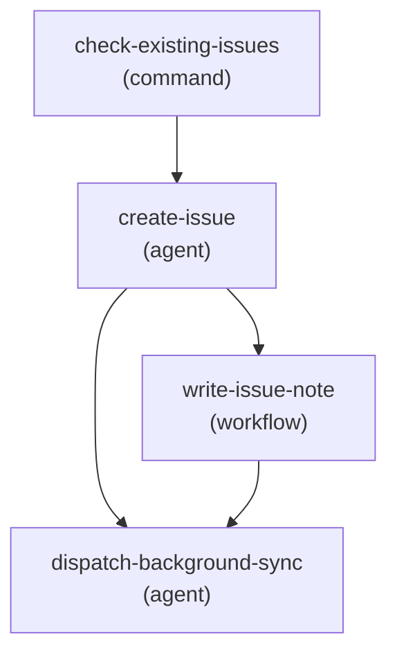

# kiln-report-issue

> _Generated from `plugin-kiln/workflows/kiln-report-issue.json` — do not edit by hand. Regenerate via `plugin-wheel/scripts/render/render-workflow.sh`._

## Flow



## Steps

### check-existing-issues

**Type:** `command`

```bash
echo '## Existing Backlog Issues' && ls .kiln/issues/*.md 2>/dev/null || echo '(none)' && echo '---' && echo '## Completed Issues' && ls .kiln/issues/completed/*.md 2>/dev/null || echo '(none)'
```

### create-issue

**Type:** `agent`

_Create a new backlog issue in .kiln/issues/. The user will have described the issue when they started this workflow — read the workflow activation context for their description._

### write-issue-note

**Type:** `workflow`

### dispatch-background-sync

**Type:** `agent`

_You are the `dispatch-background-sync` step of `kiln:kiln-report-issue`. Your job is to fire-and-forget a background sub-agent that handles counter-gated reconciliation, then write the foreground user-facing output and stop. Do NOT wait for the sub-agent. Do NOT run shelf-sync or shelf-propose-manifest-improvement yourself._

